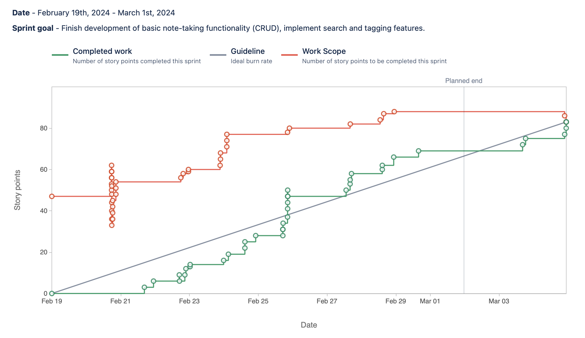
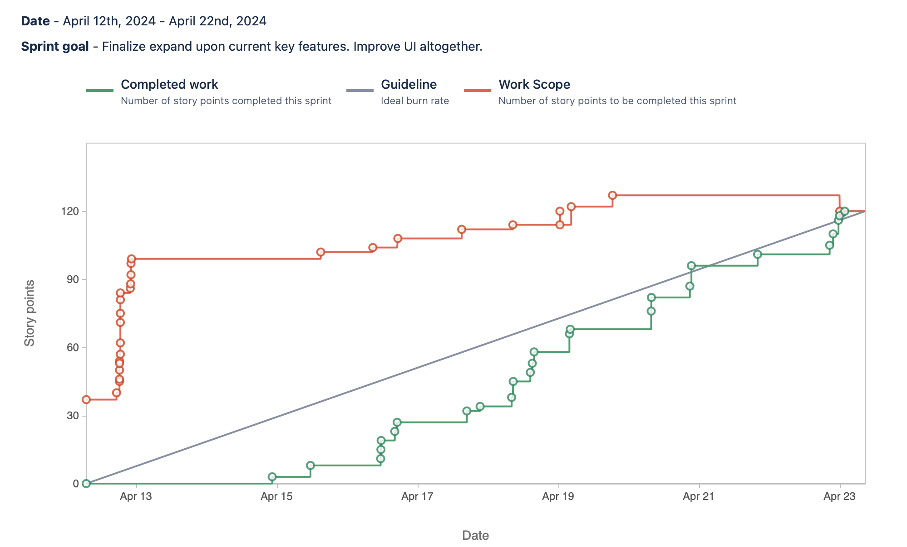
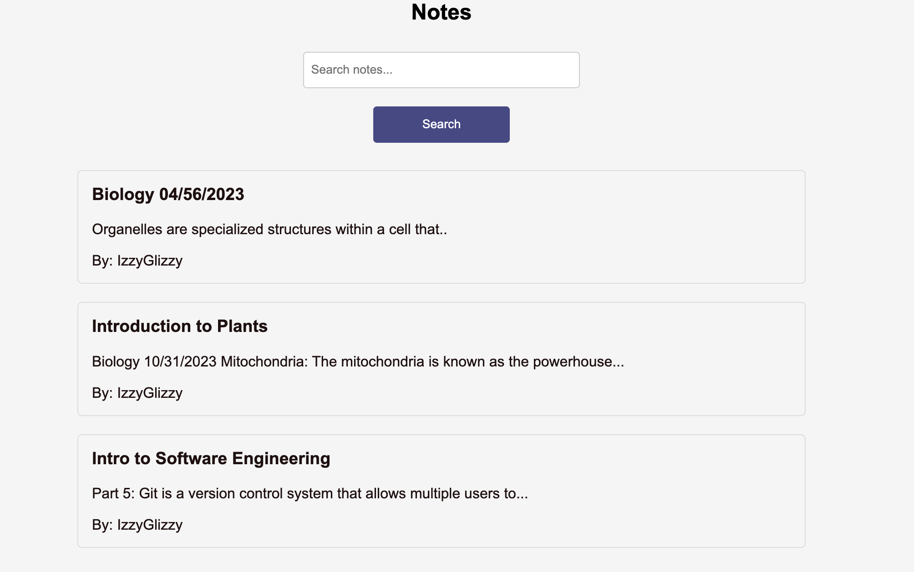

# FlowNote

> FlowNote is an innovative, AI-powered note-taking application that enhances user productivity by offering advanced features like real-time speech-to-text conversion and intelligent note summarization.

## Table of Contents
* [Team](#team)
* [General Info](#general-information)
* [Technologies Used](#technologies-used)
* [Features](#features)
* [Screenshots](#screenshots)
* [Setup](#setup)
* [Usage](#usage)
* [Project Status](#project-status)
* [Room for Improvement](#room-for-improvement)
* [Acknowledgements](#acknowledgements)
* [Contact](#contact)

## Team
We are a team of Texas State University students developing this project as part of our Software Engineering course.

* Samuel Pope
* Israel Ibinayin
* John Yamamoto
* Matthew Ruiz

## General Information
- FlowNote is designed to address the challenges of traditional note-taking by integrating AI capabilities, making the process more intuitive and efficient.
- The aim is to provide a seamless platform for users to create, organize, and summarize notes with minimal effort, leveraging AI to enhance the overall experience.
- This project was initiated to explore the integration of AI in everyday productivity tools, pushing the boundaries of conventional note-taking solutions.

## Technologies Used
- Django - version 5.0.2
- MongoDB - version 4.4
- SQLite - version 3.33

## Features
- **Speech-to-Text**: Transform spoken words into written notes effortlessly, making note-taking more accessible and convenient.
- **AI Summarization**: Employ AI to condense long notes into brief, digestible summaries, saving time and enhancing information retention.
- **Dual Database Architecture**: Utilize SQLite for managing user data and authentication, while employing MongoDB for storing and handling dynamic, unstructured note content.

## Sprint 1 ##
* **Israel Ibinayin:** "Implement OpenAI to quickly answer user questions, and created page layouts, designs, and added styles using CSS."
    * `Jira Task SCRUM-4: Design AI Assistant Integration.`
        * [SCRUM-4](https://cs3398s24klingons.atlassian.net/browse/SCRUM-4), [Bitbucket]()
    * `Jira Task SCRUM-5: Implement AI Assistant Integration.`
        * [SCRUM-5](https://cs3398s24klingons.atlassian.net/browse/SCRUM-5), [Bitbucket]()
    * `Jira Task SCRUM-6: Unit Testing for AI Assistant Integration.`
        * [SCRUM-6](https://cs3398s24klingons.atlassian.net/browse/SCRUM-6), [Bitbucket](https://bitbucket.org/cs3398s24klingons/%7Bb2711573-9b30-4954-9eb2-f53fdeb8c451%7D/commits/c6b020dca78409e3ac578e0fb1e7de2e6a18e3d0)
    * `Jira Task SCRUM-7: User Interface Design for AI Assistant.`
        * [SCRUM-7](https://cs3398s24klingons.atlassian.net/browse/SCRUM-7), [Bitbucket]()
    * `Jira Task SCRUM-8: Implement User Interface for AI Assistant.`
        * [SCRUM-8](https://cs3398s24klingons.atlassian.net/browse/SCRUM-8), [Bitbucket]()
    
* **Samuel Pope:**
    * `Jira Task SCRUM-14: Design Search Functionality.`
        * [SCRUM-14](https://cs3398s24klingons.atlassian.net/browse/SCRUM-14), [Bitbucket]()
    * `Jira Task SCRUM-15: Implement Search Backend.`
        * [SCRUM-15](https://cs3398s24klingons.atlassian.net/browse/SCRUM-15), [Bitbucket]()
    * `Jira Task SCRUM-17: User Interface Design for Search.`
        * [SCRUM-17](https://cs3398s24klingons.atlassian.net/browse/SCRUM-17), [Bitbucket]()
    * `Jira Task SCRUM-18: Implement User Interface for Search.`
        * [SCRUM-18](https://cs3398s24klingons.atlassian.net/browse/SCRUM-18), [Bitbucket]()
    * `Jira Task SCRUM-42: Design the Note Model.`
        * [SCRUM-42](https://cs3398s24klingons.atlassian.net/browse/SCRUM-42), [Bitbucket]()
    * `Jira Task SCRUM-43: Implement CRUD Views.`
        * [SCRUM-43](https://cs3398s24klingons.atlassian.net/browse/SCRUM-43), [Bitbucket]()
    * `Jira Task SCRUM-44: Create Note Templates`
        * [SCRUM-44](https://cs3398s24klingons.atlassian.net/browse/SCRUM-44), [Bitbucket]()
    * `Jira Task SCRUM-45: Implement URL Routing.`
        * [SCRUM-45](https://cs3398s24klingons.atlassian.net/browse/SCRUM-45), [Bitbucket]()
    * `Jira Task SCRUM-47: Design the User Registration Form.`
        * [SCRUM-47](https://cs3398s24klingons.atlassian.net/browse/SCRUM-47), [Bitbucket]()
    * `Jira Task SCRUM-48: Implement User Authentication Views.`
        * [SCRUM-48](https://cs3398s24klingons.atlassian.net/browse/SCRUM-48), [Bitbucket]()
    * `Jira Task SCRUM-49: Create Authentication Templates.`
        * [SCRUM-49](https://cs3398s24klingons.atlassian.net/browse/SCRUM-49), [Bitbucket]()
    * `Jira Task SCRUM-51: Unit Testing for Authentication.`
        * [SCRUM-51](https://cs3398s24klingons.atlassian.net/browse/SCRUM-51), [Bitbucket]()
    * `Jira Task SCRUM-58: Develop a Note Analysis Backend Service.`
        * [SCRUM-58](https://cs3398s24klingons.atlassian.net/browse/SCRUM-58), [Bitbucket]()
    * `Jira Task SCRUM-62: Integrate Djongo/MongoDB into Backend Operations.`
        * [SCRUM-62](https://cs3398s24klingons.atlassian.net/browse/SCRUM-62), [Bitbucket]()
    * `Jira Task SCRUM-63: Base Template Footer doesn't resize/scroll along with the other page contents.`
        * [SCRUM-63](https://cs3398s24klingons.atlassian.net/browse/SCRUM-63), [Bitbucket]()
    * `Jira Task SCRUM-65:User Auth: Notes should be private to the User/Login Credentials.`
        * [SCRUM-65](https://cs3398s24klingons.atlassian.net/browse/SCRUM-65), [Bitbucket]()
    * `Jira Task SCRUM-66: Develop Note Content Parsing and Analysis Module.`
        * [SCRUM-66](https://cs3398s24klingons.atlassian.net/browse/SCRUM-66), [Bitbucket]()
    * `Jira Task SCRUM-72: Create a Separate App for AI and Complex Data Operations.`
        * [SCRUM-72](https://cs3398s24klingons.atlassian.net/browse/SCRUM-72), [Bitbucket]()
    * `Jira Task SCRUM-73: Integrate ML models (Build AI Features).`
        * [SCRUM-73](https://cs3398s24klingons.atlassian.net/browse/SCRUM-73), [Bitbucket]()
    * `Jira Task SCRUM-74: Integrate External APIs for Complex Data Operations (Build/Test AI Features).`
        * [SCRUM-74](https://cs3398s24klingons.atlassian.net/browse/SCRUM-74), [Bitbucket]()
    * `Jira Task SCRUM-77: User Auth: Modify to use FlowNote Acct & Re-style Auth Options.`
        * [SCRUM-77](https://cs3398s24klingons.atlassian.net/browse/SCRUM-77), [Bitbucket]()
    * `Jira Task SCRUM-78: ModuleNotFoundError: 'flownote' not found.`
        * [SCRUM-78](https://cs3398s24klingons.atlassian.net/browse/SCRUM-78), [Bitbucket]()
    * `Jira Task SCRUM-79: Runtime Error: Model Class allauth.account.models.EmailAddress is defined in settings.py but throwing exception.`
        * [SCRUM-79](https://cs3398s24klingons.atlassian.net/browse/SCRUM-79), [Bitbucket]()
    * `Jira Task SCRUM-80: Migration from SQLite3 to SQL Server.`
        * [SCRUM-80](https://cs3398s24klingons.atlassian.net/browse/SCRUM-80), [Bitbucket]()

* **Matthew Ruiz:** "Email Verification, Test Summarization feature, and Integrate External APIs."
    * `Jira Task SCRUM-24: Test OpenAI Summarization Feature.`
        * [SCRUM-24](https://cs3398s24klingons.atlassian.net/browse/SCRUM-24), [Bitbucket]()
    * `Jira Task SCRUM-25: The user interface for submitting documents and receiving summaries must be intuitive, and easy to navigate.`
        * [SCRUM-25](https://cs3398s24klingons.atlassian.net/browse/SCRUM-25), [Bitbucket]()
    * `Jira Task SCRUM-50: Setup Email Verification.`
        * [SCRUM-50](https://cs3398s24klingons.atlassian.net/browse/SCRUM-50), [Bitbucket](https://bitbucket.org/cs3398s24klingons/flownote/commits/branch/feature%2FSCRUM-50-setup-email-verification)
    * `Jira Task SCRUM-74: Integrate External APIs for Complex Data Operations (Build/Test AI Features).`
        * [SCRUM-74](https://cs3398s24klingons.atlassian.net/browse/SCRUM-74), [Bitbucket](https://bitbucket.org/cs3398s24klingons/flownote/branch/SCRUM-7-user-interface-design-for-ai)

* **John Yamamoto:** "Implement AI generated Summaries, and Create CRUD tests for Notes."
    * `Jira Task SCRUM-22: Implement Generative AI API to summarize notes.`
        * [SCRUM-22](https://cs3398s24klingons.atlassian.net/browse/SCRUM-22), [Bitbucket](https://bitbucket.org/cs3398s24klingons/flownote/commits/0ecd11a18b9433d750b847b03a1456dc9cfaec43)
    * `Jira Task SCRUM-23: A Method to add Summary to notes.`
        * [SCRUM-23](https://cs3398s24klingons.atlassian.net/browse/SCRUM-23), [Bitbucket](https://bitbucket.org/cs3398s24klingons/flownote/commits/dab858cf2a54ddeee5aa8cd5bf978da1eaeae0cd)
    * `Jira Task SCRUM-46: Write Unit Tests for CRUD Operations.`
        * [SCRUM-46](https://cs3398s24klingons.atlassian.net/browse/SCRUM-46), [Bitbucket](https://bitbucket.org/cs3398s24klingons/flownote/commits/d6d734ec88323ca881b1df17ab634fb55052eb97)

## 1st Report ##

## Next Steps (Sprint 2) ##
* **Israel Ibinayin:**
    * 
* **Samuel Pope:**
    * Integrate OCR technology for converting handwritten notes to digital text.
    * Develop a recommendation engine based on user activity.
    * Implement speech-to-text functionality for note dictation.
    * Convert lecture notes into audio presentations.
    * Create widgets from Microsoft Graph for important emails.
    * Enhance note sorting functionality.
    * Improve text editor features (indentation, bold text, font size, etc.).
    * Design a user profile page.
    * Implement private notes feature.
    * Plan deployment and migrate to Azure.
    * Format content delivery in visually appealing formats like mind maps and interactive columns.

* **Matthew Ruiz:**
    * Create a toggle view for AI Assistant
    * Enhance Search Functionality
* **John Yamamoto:**
    * Look to potentially design user interface for the Analysis and Content Sugestion Features.

## Sprint 2 ##
* **Israel Ibinayin:** "Fill in"
    * `Jira Task SCRUM-103: `
        * [SCRUM-103](https://cs3398s24klingons.atlassian.net/browse/SCRUM-103), [BitBucket](https://bitbucket.org/cs3398s24klingons/%7Bb2711573-9b30-4954-9eb2-f53fdeb8c451%7D/commits/0d7d67d3d72d89409c70a0cef0160bab49dabb06)
    * `Jira Task SCRUM-104: Test and Make sure OpenAI would only work for logged in users.`
        * [SCRUM-104](https://cs3398s24klingons.atlassian.net/browse/SCRUM-104), [BitBucket](https://bitbucket.org/cs3398s24klingons/%7Bb2711573-9b30-4954-9eb2-f53fdeb8c451%7D/commits/b40b436979d6f511777e3ec61a1b32595c563550)
    * `Jira Task SCRUM-105: Fix when OpenAI is visible.`
        * [SCRUM-105](https://cs3398s24klingons.atlassian.net/browse/SCRUM-105), [BitBucket](https://bitbucket.org/cs3398s24klingons/%7Bb2711573-9b30-4954-9eb2-f53fdeb8c451%7D/commits/8fa1c5079d528ecb7770e8ab4cd03145cbf3cb26)
    * `Jira Task SCRUM-106: Allow for a loading indicator before response`
        * [SCRUM-106](https://cs3398s24klingons.atlassian.net/browse/SCRUM-106), [BitBucket](https://bitbucket.org/cs3398s24klingons/%7Bb2711573-9b30-4954-9eb2-f53fdeb8c451%7D/commits/f6d17ca7b327b628144ad292a8c805c4d3137a43)
    * `Jira Task SCRUM-107: Prompt user to login whenever they try to use OpenAI if not already.`
        * [SCRUM-107](https://cs3398s24klingons.atlassian.net/browse/SCRUM-107), [BitBucket](https://bitbucket.org/cs3398s24klingons/%7Bb2711573-9b30-4954-9eb2-f53fdeb8c451%7D/commits/64ae05d71b454deaaaa14642a8048fb8542a8ae1)
    * `Jira Task SCRUM-110: Add more information and Pictures to the homepage to assist the user.`
        * [SCRUM-110](https://cs3398s24klingons.atlassian.net/browse/SCRUM-110), [BitBucket](https://bitbucket.org/cs3398s24klingons/%7Bb2711573-9b30-4954-9eb2-f53fdeb8c451%7D/commits/2c3572956c41d3cb7954b38a228fe6a45f4d6640)
    * `Jira Task SCRUM-122: Clear the text box after sending a message to OpenAI Assistant and other bugs.`
        * [SCRUM-122](https://cs3398s24klingons.atlassian.net/browse/SCRUM-122), [BitBucket](https://bitbucket.org/cs3398s24klingons/%7Bb2711573-9b30-4954-9eb2-f53fdeb8c451%7D/commits/439a875faff14c5944349a4f4224f4dc0e7a0a50)
* **Samuel Pope:** "App Infrastructure and Analysis Engine Improvements, Note Grouping and Auto Grouping Features."
    * `Jira Task SCRUM-59: Implement Asynchronous Communication for Real-time Analysis.`
        * [SCRUM-59](https://cs3398s24klingons.atlassian.net/browse/SCRUM-59), [BitBucket](https://bitbucket.org/cs3398s24klingons/%7Bb2711573-9b30-4954-9eb2-f53fdeb8c451%7D/commits/f9646bac5998673c1c838682598dcf2d95f2d687)
    * `Jira Task SCRUM-60: Integrate Analysis Feature with Note Data Model.`
        * [SCRUM-60](https://cs3398s24klingons.atlassian.net/browse/SCRUM-60), [BitBucket](https://bitbucket.org/cs3398s24klingons/%7Bb2711573-9b30-4954-9eb2-f53fdeb8c451%7D/commits/e31867d8d7efa4c21a28d09680620d392b553692)
    * `Jira Task SCRUM-67: Design Recommendation Algorithm for Content Suggestions.`
        * [SCRUM-67](https://cs3398s24klingons.atlassian.net/browse/SCRUM-67), [BitBucket](https://bitbucket.org/cs3398s24klingons/%7Bb2711573-9b30-4954-9eb2-f53fdeb8c451%7D/commits/0b91fe3dacbd68e841c1c71f45c62c82da5aa5fd)
    * `Jira Task SCRUM-81: Refactor DataConnector App to utilize SQL Server and MongoDB.(Not used in final version)`
        * [SCRUM-81](https://cs3398s24klingons.atlassian.net/browse/SCRUM-81), [BitBucket](https://bitbucket.org/cs3398s24klingons/%7Bb2711573-9b30-4954-9eb2-f53fdeb8c451%7D/commits/5e8184bab0a84977fb45e78a5435731a3bca7dda)
    * `Jira Task SCRUM-82: Refactor notes App Logic to point to DataConnector methods for CRUD and UserAuth Operations.(Not used in final version)`
        * [SCRUM-82](https://cs3398s24klingons.atlassian.net/browse/SCRUM-82), [BitBucket](https://bitbucket.org/cs3398s24klingons/%7Bb2711573-9b30-4954-9eb2-f53fdeb8c451%7D/commits/ea5eeb9c0be883e5d4f5037b236e3ff4c7eb9adb)
    * `Jira Task SCRUM-84: CI/CD Pipelines, Deployment Server (Demo Staging).`
        * [SCRUM-84](https://cs3398s24klingons.atlassian.net/browse/SCRUM-84), [BitBucket](https://bitbucket.org/cs3398s24klingons/%7Bb2711573-9b30-4954-9eb2-f53fdeb8c451%7D/commits/6afd22d45bbc9428b64bbc2d9c47b01ca1e09f04)
    * `Jira Task SCRUM-86: Setup Django Channels.`
        * [SCRUM-86](https://cs3398s24klingons.atlassian.net/browse/SCRUM-86), [BitBucket](https://bitbucket.org/cs3398s24klingons/%7Bb2711573-9b30-4954-9eb2-f53fdeb8c451%7D/commits/ac2e61145fc930d1ce1d9640bb435b467538553c)
    * `Jira Task SCRUM-87: Define WebSocket Consumer.`
        * [SCRUM-87](https://cs3398s24klingons.atlassian.net/browse/SCRUM-87), [BitBucket](https://bitbucket.org/cs3398s24klingons/%7Bb2711573-9b30-4954-9eb2-f53fdeb8c451%7D/commits/5951ef4a89d3b2696e803188e1d11568ec3ae3cd)
    * `Jira Task SCRUM-92: Database Model Implementation.`
        * [SCRUM-92](https://cs3398s24klingons.atlassian.net/browse/SCRUM-92), [BitBucket](https://bitbucket.org/cs3398s24klingons/%7Bb2711573-9b30-4954-9eb2-f53fdeb8c451%7D/commits/058a0dcdf6bad48a7df6ce6ae93dff5a54281334)
    * `Jira Task SCRUM-93: Form Creation for Group Management.`
        * [SCRUM-93](https://cs3398s24klingons.atlassian.net/browse/SCRUM-93), [BitBucket](https://bitbucket.org/cs3398s24klingons/%7Bb2711573-9b30-4954-9eb2-f53fdeb8c451%7D/commits/1d5dfb00f81d02a56a31371671260b9bcd96494c)
    * `Jira Task SCRUM-94: View Functions for Group Management and Note Assignment.`
        * [SCRUM-94](https://cs3398s24klingons.atlassian.net/browse/SCRUM-94), [BitBucket](https://bitbucket.org/cs3398s24klingons/%7Bb2711573-9b30-4954-9eb2-f53fdeb8c451%7D/commits/1d5dfb00f81d02a56a31371671260b9bcd96494c)
    * `Jira Task SCRUM-95: Template Development.`
        * [SCRUM-95](https://cs3398s24klingons.atlassian.net/browse/SCRUM-95), [BitBucket](https://bitbucket.org/cs3398s24klingons/%7Bb2711573-9b30-4954-9eb2-f53fdeb8c451%7D/commits/7b8be26924778a14d0e806b8f130b8179a11b467)
    * `Jira Task SCRUM-96: URL Configuration.`
        * [SCRUM-96](https://cs3398s24klingons.atlassian.net/browse/SCRUM-96), [BitBucket](https://bitbucket.org/cs3398s24klingons/%7Bb2711573-9b30-4954-9eb2-f53fdeb8c451%7D/commits/1d5dfb00f81d02a56a31371671260b9bcd96494c)
* **Matthew Ruiz:** "Site-wide toggleable light/dark colorschemes, Assistant Toggle Button, and a Settings Page."
    * `Jira Task SCRUM-83: Create a toggle view for AI assistant.`
        * [SCRUM-83](https://cs3398s24klingons.atlassian.net/browse/SCRUM-83), [BitBucket](https://bitbucket.org/cs3398s24klingons/%7Bb2711573-9b30-4954-9eb2-f53fdeb8c451%7D/commits/c9701e2f9eece3fff1040d4efc816424dec9f7ed)
    * `Jira Task SCRUM-113: Add a settings page where users can select their preferred theme.`
        * [SCRUM-113](https://cs3398s24klingons.atlassian.net/browse/SCRUM-113), [BitBucket](https://bitbucket.org/cs3398s24klingons/%7Bb2711573-9b30-4954-9eb2-f53fdeb8c451%7D/commits/f4ffe4542b3bedadf555e4d7779e38fa9f86e0a5)
    * `Jira Task SCRUM-114: Light/Dark mode themes that apply where visually appropiate.`
        * [SCRUM-114](https://cs3398s24klingons.atlassian.net/browse/SCRUM-114), [BitBucket](https://bitbucket.org/cs3398s24klingons/%7Bb2711573-9b30-4954-9eb2-f53fdeb8c451%7D/commits/a4695075f3cd0aec571c3d2b029aa3888af06ee3)
    * `Jira Task SCRUM-115: Add theme previews.`
        * [SCRUM-115](https://cs3398s24klingons.atlassian.net/browse/SCRUM-115), [BitBucket](https://bitbucket.org/cs3398s24klingons/%7Bb2711573-9b30-4954-9eb2-f53fdeb8c451%7D/commits/fb12d0b3246e79444d6b9fc54dd01260752b3150)
    * `Jira Task SCRUM-116: Create a default theme prompt for user first login.`
        * [SCRUM-116](https://cs3398s24klingons.atlassian.net/browse/SCRUM-116), [BitBucket](https://bitbucket.org/cs3398s24klingons/%7Bb2711573-9b30-4954-9eb2-f53fdeb8c451%7D/commits/64b291cecd9a77585d13c12be901f28d72fdfc8b)
    * `Jira Task SCRUM-123: Apply theme variable colors to CKEdtior Rich Text Form.`
        * [SCRUM-123](https://cs3398s24klingons.atlassian.net/browse/SCRUM-123), [BitBucket](https://bitbucket.org/cs3398s24klingons/%7Bb2711573-9b30-4954-9eb2-f53fdeb8c451%7D/commits/435b4235f01d2749977fa2b13a0c3737711f58d0)
* **John Yamamoto:** "Integration of Richtext Editor into Flownote and bug fix for note search feature."
    * `Jira Task SCRUM-71:Searching with an empty filter causes the screen to go blank.`
        * [SCRUM-71](https://cs3398s24klingons.atlassian.net/browse/SCRUM-71), [BitBucket](https://bitbucket.org/cs3398s24klingons/flownote/commits/5e9fd539d604973fe5fa46d32631cf705ee5b115)
    * `Jira Task SCRUM-118: Select Rich Text Editor Library.`
        * [SCRUM-118](https://cs3398s24klingons.atlassian.net/browse/SCRUM-118), [BitBucket](https://bitbucket.org/cs3398s24klingons/%7Bb2711573-9b30-4954-9eb2-f53fdeb8c451%7D/commits/30668926e413505d34231cb6d6d1888536010c60)
    * `Jira Task SCRUM-Integrate Rich Text Editor into Django Application Models.py.`
        * [SCRUM-119](https://cs3398s24klingons.atlassian.net/browse/SCRUM-119), [BitBucket](https://bitbucket.org/cs3398s24klingons/%7Bb2711573-9b30-4954-9eb2-f53fdeb8c451%7D/commits/47a6d46e9ba8591f4f0f116190bd5ae18e9ad81c)
    * `Jira Task SCRUM-120: Integrate Richtest editor into Forms.py.`
        * [SCRUM-120](https://cs3398s24klingons.atlassian.net/browse/SCRUM-120), [BitBucket](https://bitbucket.org/cs3398s24klingons/%7Bb2711573-9b30-4954-9eb2-f53fdeb8c451%7D/commits/85709844519f14298ec1a5f15ee2a45b5e20381f)
    * `Jira Task SCRUM-121: Implement CKeditor into templates.`
        * [SCRUM-121](https://cs3398s24klingons.atlassian.net/browse/SCRUM-121), [BitBucket](https://bitbucket.org/cs3398s24klingons/%7Bb2711573-9b30-4954-9eb2-f53fdeb8c451%7D/commits/f841984795b2170e41035b9040b397efbb0717c1)

## 2nd Report ##

## Next Steps (Sprint 3) ##
* **Israel Ibinayin:**
    * Will finish tasks from User Stories that did not make it to sprint 2
    * Will add functionality to allow the user to move the AI Assistant around (without intefering with the toggle assistant button)
    * Integrate TTS functionality for user notes that reads it out loud to increase accessibility
    * Make the information provided in the home page more interactive and reactive to user
    * Integrate the home page screenshots with the user theme to make it flow better within the app
* **Samuel Pope**
    * Power Analysis Engine using GPT-2 Transformer. 
    * Improve Note Grouping and Auto Grouping UI.
    * Implement note content autocompletion feature. 
* **Matthew Ruiz**
    * Work on reintegrating social account login/registration.
    * Keep colorschemes up to date with any new pages added in Sprint 3.
    * Expand Profile/Settings page, adding more options.
* **John Yamamoto**
    * Work to enable the addition of adding images to notes
    * Work on any bugs for final demo
    * Assist in making features user friendly

## Sprint 3 ##
* **Israel Ibinayin:**
    * `Jira Task SCRUM-124: `
        * [SCRUM-124](https://cs3398s24klingons.atlassian.net/browse/SCRUM-124), [BitBucket](https://bitbucket.org/cs3398s24klingons/%7Bb2711573-9b30-4954-9eb2-f53fdeb8c451%7D/pull-requests/36)
    * `Jira Task SCRUM-9: `
        * [SCRUM-9](https://cs3398s24klingons.atlassian.net/browse/SCRUM-9), [BitBucket](https://bitbucket.org/cs3398s24klingons/%7Bb2711573-9b30-4954-9eb2-f53fdeb8c451%7D/pull-requests/42)
    * `Jira Task SCRUM-135: `
        * [SCRUM-135](https://cs3398s24klingons.atlassian.net/browse/SCRUM-135), [BitBucket](https://bitbucket.org/cs3398s24klingons/%7Bb2711573-9b30-4954-9eb2-f53fdeb8c451%7D/pull-requests/37)
    * `Jira Task SCRUM-13: `
        * [SCRUM-13](https://cs3398s24klingons.atlassian.net/browse/SCRUM-13), [BitBucket](https://bitbucket.org/cs3398s24klingons/%7Bb2711573-9b30-4954-9eb2-f53fdeb8c451%7D/pull-requests/34)
    * `Jira Task SCRUM-10: `
        * [SCRUM-10](https://cs3398s24klingons.atlassian.net/browse/SCRUM-10), [BitBucket](https://bitbucket.org/cs3398s24klingons/%7Bb2711573-9b30-4954-9eb2-f53fdeb8c451%7D/pull-requests/49)
    * `Jira Task SCRUM-11: `
        * [SCRUM-11](https://cs3398s24klingons.atlassian.net/browse/SCRUM-11), [BitBucket](https://bitbucket.org/cs3398s24klingons/%7Bb2711573-9b30-4954-9eb2-f53fdeb8c451%7D/pull-requests/53)
    * `Jira Task SCRUM-149: `
        * [SCRUM-149](https://cs3398s24klingons.atlassian.net/browse/SCRUM-149), [BitBucket](https://bitbucket.org/cs3398s24klingons/%7Bb2711573-9b30-4954-9eb2-f53fdeb8c451%7D/pull-requests/52)
        
* **Samuel Pope:** "Enhanced AI Features"

    * `Jira Task SCRUM-90: Present Analysis Feedback.`
        * [SCRUM-90](https://cs3398s24klingons.atlassian.net/browse/SCRUM-90), [BitBucket](https://bitbucket.org/cs3398s24klingons/%7Bb2711573-9b30-4954-9eb2-f53fdeb8c451%7D/commits/6014bcb0f2d7908ba62064004898faf69778548d)

    * `Jira Task SCRUM-97: Enhancements and Fine-Tuning.`
        * [SCRUM-97](https://cs3398s24klingons.atlassian.net/browse/SCRUM-97), [BitBucket](https://bitbucket.org/cs3398s24klingons/%7Bb2711573-9b30-4954-9eb2-f53fdeb8c451%7D/commits/2951276e36265a7d336938da29999dce2d1662ba)

    * `Jira Task SCRUM-98: Import and Write Scripts to train BERT, GPT Transformers.`
        * [SCRUM-98](https://cs3398s24klingons.atlassian.net/browse/SCRUM-98), [BitBucket](https://bitbucket.org/cs3398s24klingons/%7Bb2711573-9b30-4954-9eb2-f53fdeb8c451%7D/commits/22f80dd7ec2e65ca943d13f45be38708eaef6ca8)

    * `Jira Task SCRUM-125: https://cs3398s24klingons.atlassian.net/browse/SCRUM-125.`
        * [SCRUM-125](https://cs3398s24klingons.atlassian.net/browse/SCRUM-125), [BitBucket](https://bitbucket.org/cs3398s24klingons/%7Bb2711573-9b30-4954-9eb2-f53fdeb8c451%7D/commits/d50377fd9cdd5fefce6cd441c525a320caecffb6)

    *`Jira Task SCRUM-126: Enhance GPT-2 Autocompletion UI.`
        * [SCRUM-126](https://cs3398s24klingons.atlassian.net/browse/SCRUM-126), [BitBucket](https://bitbucket.org/cs3398s24klingons/%7Bb2711573-9b30-4954-9eb2-f53fdeb8c451%7D/commits/19ee19fdb00734c85f4b43bff44ffe5604e40c62)

    * `Jira Task SCRUM-128:  Implement Vocabulary Extraction.`
        * [SCRUM-128](https://cs3398s24klingons.atlassian.net/browse/SCRUM-128), [BitBucket](https://bitbucket.org/cs3398s24klingons/%7Bb2711573-9b30-4954-9eb2-f53fdeb8c451%7D/commits/6c737d61a3124878d168f3ab4db24d3517709f8b)

    * `Jira Task SCRUM-129: Refactor and Simplify AIEngine Modules.`
        * [SCRUM-129](https://cs3398s24klingons.atlassian.net/browse/SCRUM-129), [BitBucket](https://bitbucket.org/cs3398s24klingons/%7Bb2711573-9b30-4954-9eb2-f53fdeb8c451%7D/commits/7891ef432f28097e3e0e995eb34caca81e9b14fa)

    * `Jira Task SCRUM-141: Update Existing Groups Instead of Making New Ones (Auto Group).`
        * [SCRUM-141](https://cs3398s24klingons.atlassian.net/browse/SCRUM-141), [BitBucket](https://bitbucket.org/cs3398s24klingons/%7Bb2711573-9b30-4954-9eb2-f53fdeb8c451%7D/commits/b234f898fb67fd6414aaec522c5ab63b55459439)

    * `Jira Task SCRUM-142: Content Length on Autocomplete Not Reflected in generate_content Parameters.`
        * [SCRUM-142](https://cs3398s24klingons.atlassian.net/browse/SCRUM-142), [BitBucket](https://bitbucket.org/cs3398s24klingons/%7Bb2711573-9b30-4954-9eb2-f53fdeb8c451%7D/commits/d4c879eabbc9dd42c931bd4936180a463e832ae3)

    * `Jira Task SCRUM-148: Reduce Model Computational Costs (Celery, Redis).`
        * [SCRUM-148](https://cs3398s24klingons.atlassian.net/browse/SCRUM-148), [BitBucket](https://bitbucket.org/cs3398s24klingons/%7Bb2711573-9b30-4954-9eb2-f53fdeb8c451%7D/commits/c30519e4b8084034be12afcbcc46fc3de91d3ecc)

* **Matthew Ruiz:** "Fill In"

    * `Jira Task SCRUM-101: Adding Social Authentication Login.`
        * [SCRUM-101](https://cs3398s24klingons.atlassian.net/browse/SCRUM-101), [BitBucket](https://bitbucket.org/cs3398s24klingons/%7Bb2711573-9b30-4954-9eb2-f53fdeb8c451%7D/commits/0f738dd7d8f7459b5dff1539cf8602b5ea6dd023)

    * `Jira Task SCRUM-136: Fix styling where necessary.`
        * [SCRUM-136](https://cs3398s24klingons.atlassian.net/browse/SCRUM-136), [BitBucket](https://bitbucket.org/cs3398s24klingons/%7Bb2711573-9b30-4954-9eb2-f53fdeb8c451%7D/commits/e68a6add7fe2b929256f756c1c423d6383374267)

    * `Jira Task SCRUM-138: Implement Change Password Functionality.`
        * [SCRUM-138](https://cs3398s24klingons.atlassian.net/browse/SCRUM-138), [BitBucket](https://bitbucket.org/cs3398s24klingons/%7Bb2711573-9b30-4954-9eb2-f53fdeb8c451%7D/commits/7c75f0417e8179a65052a15ecfb8f1828c9772dc)

    * `Jira Task SCRUM-139: Implement Change Username Functionality.`
        * [SCRUM-139](https://cs3398s24klingons.atlassian.net/browse/SCRUM-139), [BitBucket](https://bitbucket.org/cs3398s24klingons/%7Bb2711573-9b30-4954-9eb2-f53fdeb8c451%7D/commits/0fb219f580dc39567e77b5a3126831edc7105019)

    * `Jira Task SCRUM-140: Contact Support Functionality.`
        * [SCRUM-140](https://cs3398s24klingons.atlassian.net/browse/SCRUM-140), [BitBucket](https://bitbucket.org/cs3398s24klingons/%7Bb2711573-9b30-4954-9eb2-f53fdeb8c451%7D/commits/7b5a7b163d8da95e84837d041c9fd0c7e907c573)

* **John Yamamoto:** "Implmented sorting and pinning features to the note list page."

    * `Jira Task SCRUM-132: Implement front end ability to pin specific notes to the top of the list.`
        * [SCRUM-132](https://cs3398s24klingons.atlassian.net/browse/SCRUM-132), [BitBucket](https://bitbucket.org/cs3398s24klingons/%7Bb2711573-9b30-4954-9eb2-f53fdeb8c451%7D/commits/0ccc12a8896fd21a246a591d17216d90d2bfb02a)

    * `Jira Task SCRUM-133: Implement alphabetical sorting of note list.`
        * [SCRUM-133](https://cs3398s24klingons.atlassian.net/browse/SCRUM-133), [BitBucket](https://bitbucket.org/cs3398s24klingons/%7Bb2711573-9b30-4954-9eb2-f53fdeb8c451%7D/commits/03e005c47f0ccfb68a03a393c4b9eec528e32fb4)

    * `Jira Task SCRUM-134: Implement time (most recent) sorting of note list.`
        * [SCRUM-134](https://cs3398s24klingons.atlassian.net/browse/SCRUM-134), [BitBucket](https://bitbucket.org/cs3398s24klingons/%7Bb2711573-9b30-4954-9eb2-f53fdeb8c451%7D/commits/0d435febde54115cee36f9ecaf509a719abcffaa)

## 3rd Report ##

## Next Steps ##
* **Israel Ibinayin**
    * "Add caching to save the user from losing progress"
    * Implement autosave feature (saves the notes each time user stops typing)
* **Samuel Pope**
    * Train GPT-2 to fine-tune summarization
    * Allow users to customize their response length and sequence size.
* **Matthew Ruiz**
    * "Fill in"
* **John Yamamoto**
    * Add Sort function to other other features.
    * Add Pin function to other features.
    * Add more interactive note features. 
## Screenshots

## Setup
FlowNote requires Python 3.12.1, MongoDB, and an environment capable of running Django. 

To get started:
1. Clone the repository to your local machine.
2. Install the required Python packages: `pip install -r requirements.txt`.
3. Apply migrations to set up the database: `python manage.py migrate`.
4. Start the Django development server: `python manage.py runserver`.

## Usage
Once the server is running, access FlowNote through your web browser at `http://127.0.0.1:8000/`. Register for an account or log in to begin creating and managing your notes. Utilize the speech-to-text feature to dictate notes and leverage the AI summarization to review notes efficiently.

## Project Status
Project is: _in progress_. Future updates are planned to introduce more sophisticated AI models for improved feature performance and additional user functionalities.

## Room for Improvement
* Future enhancements include:
    * Expanding AI capabilities for greater accuracy in speech-to-text transcription.
    * Introducing more advanced algorithms for note summarization to cater to various content types.

* Planned features:
    * Implementing guest user functionality with session-based note storage.
    * Enhancing the user interface for a more engaging and intuitive user experience.

## Acknowledgements
- This project was inspired by a vision to revolutionize the way we take and manage notes.
- Special thanks to the Django community for their invaluable resources and support.

## Contact
Created by Samuel Pope and John Yamamoto - feel free to reach out at sjpope03@gmail.com.