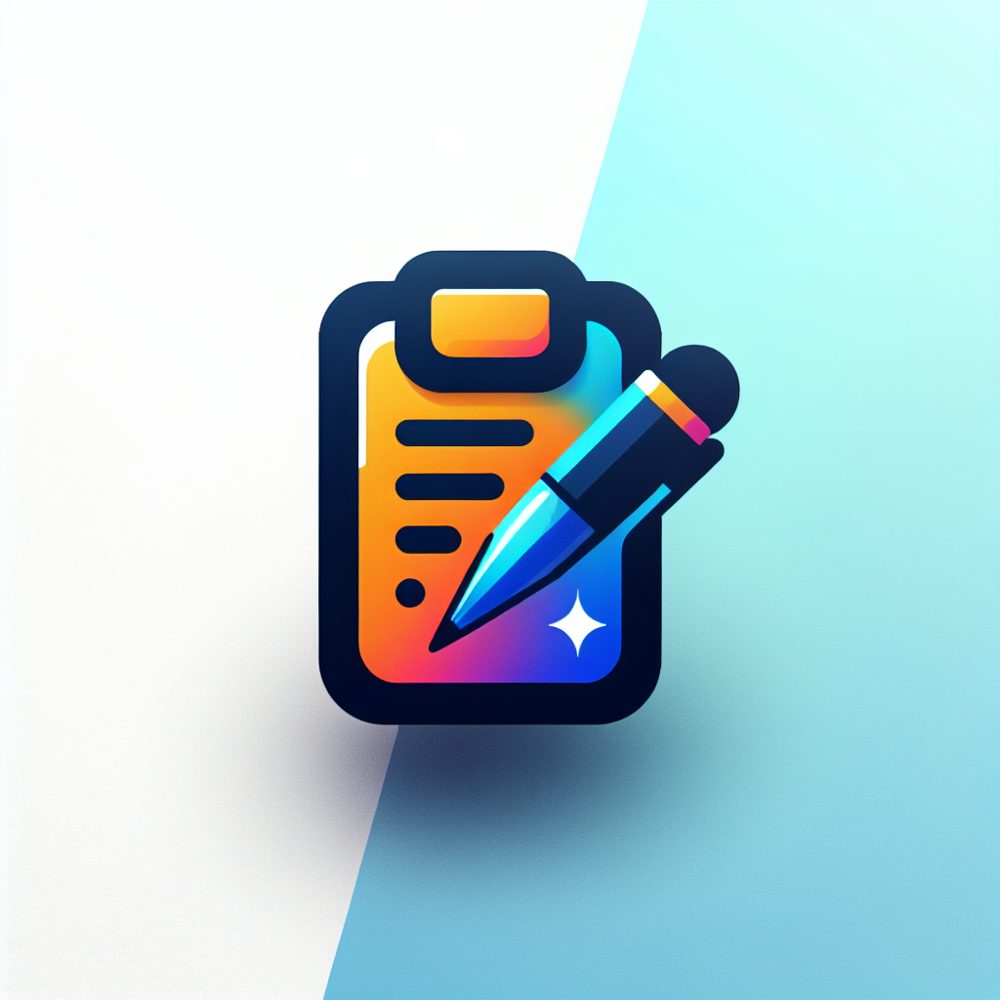

# FlowNote

> FlowNote is an innovative, AI-powered note-taking application that enhances user productivity by offering advanced features like real-time speech-to-text conversion and intelligent note summarization.

## Table of Contents
* [Team](#team)
* [General Info](#general-information)
* [Technologies Used](#technologies-used)
* [Features](#features)
* [Screenshots](#screenshots)
* [Setup](#setup)
* [Usage](#usage)
* [Project Status](#project-status)
* [Room for Improvement](#room-for-improvement)
* [Acknowledgements](#acknowledgements)
* [Contact](#contact)

## Team
We are a team of Texas State University students developing this project as part of our Software Engineering course.

* Samuel Pope
* Israel Ibinayin
* John Yamamoto
* Matthew Ruiz

## General Information
- FlowNote is designed to address the challenges of traditional note-taking by integrating AI capabilities, making the process more intuitive and efficient.
- The aim is to provide a seamless platform for users to create, organize, and summarize notes with minimal effort, leveraging AI to enhance the overall experience.
- This project was initiated to explore the integration of AI in everyday productivity tools, pushing the boundaries of conventional note-taking solutions.

## Technologies Used
- Django - version 5.0.2
- MongoDB - version 4.4
- SQLite - version 3.33

## Features
- **Speech-to-Text**: Transform spoken words into written notes effortlessly, making note-taking more accessible and convenient.
- **AI Summarization**: Employ AI to condense long notes into brief, digestible summaries, saving time and enhancing information retention.
- **Dual Database Architecture**: Utilize SQLite for managing user data and authentication, while employing MongoDB for storing and handling dynamic, unstructured note content.

## Screenshots

## Setup
FlowNote requires Python 3.12.1, MongoDB, and an environment capable of running Django. 

To get started:
1. Clone the repository to your local machine.
2. Install the required Python packages: `pip install -r requirements.txt`.
3. Apply migrations to set up the database: `python manage.py migrate`.
4. Start the Django development server: `python manage.py runserver`.

## Usage
Once the server is running, access FlowNote through your web browser at `http://127.0.0.1:8000/`. Register for an account or log in to begin creating and managing your notes. Utilize the speech-to-text feature to dictate notes and leverage the AI summarization to review notes efficiently.

## Project Status
Project is: _in progress_. Future updates are planned to introduce more sophisticated AI models for improved feature performance and additional user functionalities.

## Room for Improvement
Future enhancements include:
- Expanding AI capabilities for greater accuracy in speech-to-text transcription.
- Introducing more advanced algorithms for note summarization to cater to various content types.

Planned features:
- Implementing guest user functionality with session-based note storage.
- Enhancing the user interface for a more engaging and intuitive user experience.

## Acknowledgements
- This project was inspired by a vision to revolutionize the way we take and manage notes.
- Special thanks to the Django community for their invaluable resources and support.

## Contact
Created by Samuel Pope - feel free to reach out at sjpope03@gmail.com.